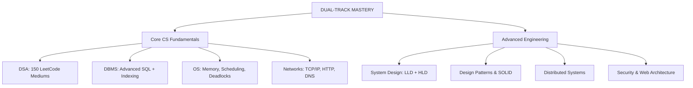

# Master Study Plan: SEBI Grade A IT + SDE-2/3 Dual-Track

**Date Created:** 2026-08-28  
**Target Exams:** SEBI Grade A (IT), NABARD IT, CIL MT Systems  
**Parallel Career Track:** Tier-1 PBC SDE-2/3 (₹65L–₹70L target)  
**Planning Horizon:** Aug 28, 2026 onward | **Age Cap:** 30 years in May 2027  
**Operating Rule:** Prepare for SEBI urgently, but never assume an IT vacancy or exam notification will arrive.

> **Important uncertainty:** SEBI recruitment is irregular. The Apr–May 2027 window is a possible final age-eligible opportunity, not a guaranteed exam date. Keep PBC preparation active from day one and make a formal decision on **January 1, 2027** based only on official notifications available by then.

---

## 1. MASTER CURRICULUM OVERVIEW

### Pragmatic Parallel Track

| Period | SEBI focus | PBC focus | Decision rule |
| :--- | :---: | :---: | :--- |
| Aug 28–Dec 31, 2026 | 60% | 40% | Build a shared foundation and keep both options viable |
| Through Dec 31, 2026 | 60% | 40% | Monitor official SEBI notifications; increase PBC interview readiness |
| On Jan 1, 2027, if announced | 70–90% | 10–30% | Prepare for the actual exam date while maintaining interview continuity |
| On Jan 1, 2027, if not announced | 30% maintenance | 70% | Pivot to applications and interviews; do not wait indefinitely |

The detailed decision tree and phase-two schedules are in [05-Pragmatic-Parallel-Track.md](05-Pragmatic-Parallel-Track.md).



---

## 2. PRIORITY-BASED TOPIC BREAKDOWN

### SEBI Phase 1 Coverage (Mandatory During Phase 1)

The first 17 weeks are not only a shared foundation. Every week must include deliberate SEBI Phase 1 coverage because the exam date and vacancy cycle are uncertain.

| SEBI Phase 1 area | Phase 1 treatment | Minimum evidence by Dec 31 |
| :--- | :--- | :--- |
| **General Awareness and financial/regulatory awareness** | 15–20 minutes, 4 days/week; maintain a dated current-affairs log | 16 weeks of notes, with monthly revision |
| **English language** | 2 short sessions/week: comprehension, vocabulary, grammar, and error spotting | 8 timed sectional drills |
| **Quantitative aptitude** | 2 short sessions/week: arithmetic, percentages, ratio, averages, DI, and simplification | 8 timed sectional drills |
| **Reasoning** | 2 short sessions/week: puzzles, syllogisms, inequalities, arrangements, coding, and logical deductions | 8 timed sectional drills |
| **IT technical syllabus** | P0 CS topics below: DSA, DBMS, OS, Networks, security, web, and software engineering | 2 mixed technical revisions and 2 full mocks |

**Execution rule:** DSA, DBMS, OS, and Networks are shared with PBC, but General Awareness, English, Quantitative Aptitude, Reasoning, and exam-style timed practice are SEBI-specific and cannot be left for a later “SEBI sprint.” Check the official notification for the final pattern and weightage when released.

### SEBI Phase I Exam-Oriented Chapter Order and Study Style

Use this order for the SEBI-specific portion of Phase 1. Recheck exact marks, timing, cut-offs, and negative marking against the next official notification.

#### Paper I: Common Aptitude and Awareness

| Priority | Chapter sequence | How to study |
| :---: | :--- | :--- |
| P0 | **Quantitative Aptitude:** percentages, ratio/proportion, averages, profit/loss, interest, time/work, speed/distance, mixtures, number system, DI, simplification | One-page formula sheet, timed sets, and a calculation-error log |
| P0 | **Reasoning:** inequalities, syllogisms, coding, blood relations, directions, series, ranking, arrangements, floor/scheduling puzzles, data sufficiency | Learn standard setups, solve easy questions first, then reduce time per set |
| P1 | **English:** reading comprehension, cloze, error spotting, sentence improvement, fillers, para-jumbles, vocabulary, grammar | Daily short reading, timed comprehension, and an error notebook |
| P1 | **General Awareness:** current affairs, financial markets, banking, monetary policy, securities market, SEBI, economy, budget, static awareness | Dated monthly capsule, financial-news notes, and Sunday active recall |

#### Paper II: Information Technology Chapter Order

1. **Database Concepts:** relational model, relational algebra, tuple calculus, integrity constraints, keys, normalization, transactions, concurrency, recovery, indexing, query processing, distributed databases, and data warehousing.
2. **SQL:** DDL/DML, joins, subqueries, views, constraints, aggregation, window functions, NULL semantics, transactions, and execution-plan reasoning.
3. **Programming and Data Structures:** C/C++/Java fundamentals, pointers/references, OOP, recursion, complexity, arrays, strings, linked lists, stacks, queues, trees, heaps, hashing, graphs, sorting, searching, and dynamic programming.
4. **Algorithms:** asymptotic analysis, divide-and-conquer, greedy methods, graph algorithms, shortest paths, MST, topological sorting, backtracking, and correctness.
5. **Computer Networks:** OSI/TCP-IP, Ethernet, ARP, IP/subnetting, routing, TCP/UDP, flow/congestion control, DNS, HTTP/HTTPS, TLS, email, and network security.
6. **Operating Systems:** processes/threads, scheduling, synchronization, deadlocks, memory, virtual memory, file systems, I/O, and protection.
7. **Software Engineering:** SDLC, Agile, requirements, UML, estimation, testing, version control, design principles, architecture, maintenance, and configuration management.
8. **Web Technologies:** HTML/CSS/JavaScript fundamentals, browser/HTTP behavior, REST, APIs, sessions, cookies, authentication, authorization, and web security.
9. **Cybersecurity:** CIA triad, threat modeling, access control, cryptography, hashing, PKI, secure coding, OWASP, malware, firewalls, IDS/IPS, and incident response.
10. **Data Analytics and Emerging IT:** data preparation, descriptive statistics, basic ML, big data, cloud, virtualization, and distributed systems.

#### Exam-Oriented Study Cycle

- **Learn:** Read one chapter for 30–45 minutes and make a one-page recall sheet.
- **Recall:** Close the material and reproduce definitions, formulas, diagrams, and comparisons.
- **Practice:** Solve 20–30 MCQs or 2–3 timed aptitude sets.
- **Verify:** Review every option and classify each error as concept, calculation, vocabulary, or rushing.
- **Revisit:** Re-test after 1 day, 7 days, and 21 days.
- **Weekly:** Take one mixed sectional test; every fourth week, take a full Phase I simulation.

**SEBI-specific split:** Use approximately 40% learning, 40% timed practice, and 20% review/recall. Phase I rewards breadth, speed, accuracy, and elimination, so reading theory alone is insufficient.

---

## 2A. SEBI RECRUITMENT MONITORING

**Research checked on August 28, 2026:**
- [SEBI official careers page](https://www.sebi.gov.in/sebiweb/other/careers.jsp) is the source of truth for vacancies, notices, corrigenda, and results.
- The official-domain search result for **Recruitment of Officer Grade A (Assistant Manager) 2025** shows a notice dated **October 30, 2025** and Phase I on **January 10, 2026**.
- The official-domain result for **Recruitment of Officer Grade A (Assistant Manager) 2024** records Phase I on **July 27, 2024**.

These dates demonstrate that the cycle is variable. They do **not** establish a guaranteed 2027 notification or exam date.

### Monitoring Cadence
- **Every Sunday:** Check the official SEBI careers page and record “no update” if nothing has changed.
- **First day of every month:** Search specifically for Officer Grade A, Information Technology Stream, recruitment notice, corrigendum, Phase I, and Phase II.
- **January 1, 2027:** Make the planned allocation decision using only an official notice or the absence of one; do not wait for an informal prediction.
- **After notification:** Record application opening/closing dates, age cut-off date, Phase I date, Phase II date, fee, vacancies, and IT-stream eligibility in the tracker.

**Important:** The plan must never state an assumed “likely” SEBI exam date as fact. Until an official notice is published, Apr–May 2027 remains a possible age-eligible window, not a scheduled exam.

### **[P0 - MANDATORY] Critical Path Topics** (Must Complete First)
These topics account for **70% of exam marks** and are non-negotiable interview questions.

#### **P0.1: Data Structures & Algorithms**
| Sub-Topic | Concepts | Target | Study Hours | Deadline |
| :--- | :--- | :--- | :--- | :--- |
| **Arrays & Strings** | 2-Pointer, Sliding Window, Prefix Sums, Kadane's | 20 LeetCode Mediums | 12 hrs | Sep 15 |
| **Linked Lists** | Cycle Detection, Reversal, Merge Sorted | 12 LeetCode Mediums | 8 hrs | Sep 22 |
| **Stacks & Queues** | Monotonic Stack, Expression Parsing | 10 LeetCode Mediums | 6 hrs | Sep 29 |
| **Trees & BST** | Traversals, LCA, Diameter, Max Path Sum | 25 LeetCode Mediums | 16 hrs | Oct 13 |
| **Heaps & Priority Queues** | Min/Max Heap, Top-K, Median | 10 LeetCode Mediums | 8 hrs | Oct 20 |
| **Graphs: BFS/DFS** | Traversals, Connected Components, Bipartite | 15 LeetCode Mediums | 10 hrs | Oct 27 |
| **Shortest Paths & MST** | Dijkstra, Bellman-Ford, Kruskal, Prim | 12 LeetCode Mediums | 10 hrs | Nov 3 |
| **Binary Search** | Search Space Reduction, Rotated Arrays | 10 LeetCode Mediums | 8 hrs | Nov 10 |
| **Recursion & Backtracking** | Subsets, Permutations, N-Queens | 12 LeetCode Mediums | 10 hrs | Nov 17 |
| **Dynamic Programming** | 1D DP, 2D DP, LCS, Edit Distance, Knapsack | 28 LeetCode Mediums | 20 hrs | Dec 1 |

**P0.1 Total:** 150 LeetCode Mediums | **108 hours** | Completion: Dec 1, 2026

---

#### **P0.2: Database Management Systems (DBMS) & SQL**
| Sub-Topic | Concepts | Target | Study Hours | Deadline |
| :--- | :--- | :--- | :--- | :--- |
| **Normalization** | 1NF, 2NF, 3NF, BCNF, Functional Dependencies | Understand + 5 design problems | 10 hrs | Sep 20 |
| **Transactions & ACID** | Write-Ahead Logging (WAL), Recovery | Deep understanding | 8 hrs | Sep 27 |
| **Concurrency Control** | 2PL, Deadlock Detection, Isolation Levels | Solve 15 GateOverflow problems | 14 hrs | Oct 11 |
| **Indexing Mechanics** | B-Trees, B+ Trees, Hash Indexes, Query Plans | Derive index behavior manually | 12 hrs | Oct 25 |
| **Advanced SQL** | Complex Joins, Subqueries, Window Functions | Solve 30 Hard LeetCode Database SQL | 16 hrs | Nov 15 |
| **SQL Optimization** | Execution Plans, Query Tuning | Analyze 10 real execution plans | 10 hrs | Nov 30 |
| **OLTP vs OLAP** | Star Schema, Data Marts, ETL | Design 2 data warehouses | 8 hrs | Dec 5 |

**P0.2 Total:** 30 Hard SQL Problems + Conceptual Depth | **78 hours** | Completion: Dec 5, 2026

---

#### **P0.3: Operating Systems (OS)**
| Sub-Topic | Concepts | Target | Study Hours | Deadline |
| :--- | :--- | :--- | :--- | :--- |
| **Process & Thread Management** | Process Models, Context Switching, Scheduling (FCFS, SJF, RR, Priority) | Solve 15 GateOverflow PYQs | 12 hrs | Sep 25 |
| **Synchronization** | Mutex, Semaphores, Race Conditions, Producer-Consumer | Code 3 classic sync problems | 10 hrs | Oct 5 |
| **Memory Management** | Paging, Segmentation, Virtual Memory, Page Replacement (LRU, FIFO) | Solve 20 GateOverflow PYQs | 14 hrs | Oct 20 |
| **Deadlocks** | 4 Necessary Conditions, Banker's Algorithm, Resource Graphs | Solve 12 PYQs + Banker's manually | 10 hrs | Nov 1 |
| **File Systems & Disk I/O** | Disk Scheduling (FCFS, SSTF, SCAN), File Organization | Solve 8 PYQs | 6 hrs | Nov 10 |

**P0.3 Total:** 65 GateOverflow OS PYQs | **52 hours** | Completion: Nov 10, 2026

---

#### **P0.4: Computer Networks**
| Sub-Topic | Concepts | Target | Study Hours | Deadline |
| :--- | :--- | :--- | :--- | :--- |
| **OSI & TCP/IP Model** | Layer architectures, Protocol mapping | Deep understanding | 8 hrs | Sep 22 |
| **TCP/UDP & Transport** | 3-Way Handshake, Flow Control, Congestion Control | Solve 10 GateOverflow PYQs | 10 hrs | Oct 5 |
| **IP & Routing** | IPv4/IPv6, Subnetting (CIDR), Routing Algorithms (RIP, OSPF, BGP) | Solve 15 PYQs + manual calculations | 14 hrs | Oct 20 |
| **DNS & Application Layer** | DNS Resolution, HTTP/1.1 vs HTTP/2, HTTPS/TLS Handshake | Deep understanding + protocol flows | 10 hrs | Nov 1 |
| **Advanced Topics** | WebSockets, gRPC, Load Balancing | Solve 8 PYQs | 8 hrs | Nov 15 |

**P0.4 Total:** 43 GateOverflow Network PYQs | **50 hours** | Completion: Nov 15, 2026

---

### **[P1 - HIGH ROI] Senior Engineering & Interview Prep**
These topics are the active parallel PBC track. They also reinforce the shared CS foundation, but must not be postponed until a SEBI result or notification.

#### **P1.1: Low-Level Design (LLD) & Design Patterns**
| Sub-Topic | Concepts | Target | Study Hours | Deadline |
| :--- | :--- | :--- | :--- | :--- |
| **SOLID Principles** | Single Responsibility, Open/Closed, Liskov, ISP, DIP | Write 5 code examples per principle | 10 hrs | Oct 10 |
| **Creational Patterns** | Factory, Abstract Factory, Singleton, Builder | Implement 4 patterns end-to-end | 8 hrs | Oct 20 |
| **Structural Patterns** | Adapter, Decorator, Proxy, Facade | Implement 4 patterns end-to-end | 8 hrs | Oct 30 |
| **Behavioral Patterns** | Strategy, Observer, Command, Chain of Responsibility | Implement 4 patterns end-to-end | 8 hrs | Nov 10 |
| **LLD Problems** | Rate Limiter, Parking Lot, LRU Cache, Notification System | Implement 4 full LLD systems | 20 hrs | Dec 5 |

**P1.1 Total:** 10 Complete LLD Implementations | **54 hours** | Completion: Dec 5, 2026

---

#### **P1.2: High-Level Design (HLD) & Distributed Systems**
| Sub-Topic | Concepts | Target | Study Hours | Deadline |
| :--- | :--- | :--- | :--- | :--- |
| **Load Balancing & Scaling** | Load Balancers (L4/L7), Horizontal/Vertical Scaling, Replication | Design docs for 2 systems | 10 hrs | Oct 25 |
| **Caching Strategies** | Read-Through, Write-Through, Write-Back, Redis, Memcached | Design cache layer for 3 systems | 8 hrs | Nov 5 |
| **Message Queues & Events** | Kafka vs RabbitMQ, Pub/Sub, Event-Driven Architecture | Design 2 async systems | 8 hrs | Nov 15 |
| **Database Sharding** | Sharding strategies, Consistent Hashing, Replication | Design sharded DB for 2 cases | 10 hrs | Nov 25 |
| **CAP Theorem & Trade-offs** | Consistency, Availability, Partition Tolerance | Analyze 8 real-world systems | 6 hrs | Dec 1 |
| **HLD Case Studies** | URL Shortener, Distributed Logger, Real-Time Chat, File Storage | Design 4 complete systems with diagrams | 24 hrs | Dec 20 |

**P1.2 Total:** 8 Complete HLD System Designs | **66 hours** | Completion: Dec 20, 2026

---

#### **P1.3: Web Architecture & Security**
| Sub-Topic | Concepts | Target | Study Hours | Deadline |
| :--- | :--- | :--- | :--- | :--- |
| **Web Fundamentals** | DOM Parsing, Rendering Pipeline, Event Loop, Async/Await | Deep understanding | 8 hrs | Oct 15 |
| **API Design** | REST Constraints, OpenAPI Specs, CORS, WebSockets | Design 3 APIs following best practices | 8 hrs | Oct 30 |
| **OWASP Top 10** | SQLi, XSS, CSRF, Broken Auth | Understand + code examples | 10 hrs | Nov 10 |
| **Authentication & Authorization** | OAuth 2.0, OpenID Connect, JWT | Implement auth flow in code | 8 hrs | Nov 20 |
| **Cryptography** | Symmetric (AES), Asymmetric (RSA, ECC), Hashing | Understand mechanics | 6 hrs | Dec 1 |

**P1.3 Total:** 3 Secure API Implementations | **40 hours** | Completion: Dec 1, 2026

---

### **[P2 - RECOVERY & CONSOLIDATION] Low-Stress Revision & Rest**
Essential for retention, but lower priority in active study phase.

| Activity | Frequency | Duration | Purpose |
| :--- | :--- | :--- | :--- |
| **Error Log Review** | Weekly (Sunday) | 30 mins | Reinforce weak concepts |
| **Concept Sketching** | 2x per week | 45 mins | Visual reinforcement (Mermaid diagrams) |
| **Audio/Video Recap** | During commute | 30 mins | Passive learning of HLD topics |
| **Mock Tests** | Every 2 weeks | 3 hours | Assess retention + identify gaps |
| **Physical Recovery** | Daily | 60 mins | Weightlifting + walks (non-negotiable) |
| **Sleep & Nutrition** | Daily | 8 hrs sleep + 3 meals | Cognitive performance baseline |

**P2 Total:** 3–4 hours per week

---

## 3. EFFICIENT STUDY METHODOLOGY

### **Core Study Framework: The Feynman + Spaced Repetition Hybrid**

#### **Phase 1: LEARN (45 mins)**
- Read 1 sub-topic from reference (e.g., CLRS, Abdul Bari, Kurose & Ross)
- Watch 1 focused video explanation (10–15 mins max)
- Write 3–5 bullet-point summaries in your own words

#### **Phase 2: CODE/SOLVE (45 mins)**
- Solve 3–5 problems related to the sub-topic
- For DSA: Code from scratch (no copying)
- For System Design: Draw architecture diagrams (Mermaid)
- For DBMS: Write queries or analyze execution plans

#### **Phase 3: TEACH (15 mins buffer)**
- Explain the concept to yourself (mouth to brain)
- Identify gaps in understanding
- Update error log if mistakes occurred

#### **Phase 4: VERIFY & LOG (10 mins)**
- Compare your solution to reference solutions
- Record in error log if needed
- Mark completion in daily checklist

**Total per topic cycle:** 45 + 45 + 15 + 10 = **115 mins (~2 hours per day)**

---

### **Weekly Structure: 5-Day Intensive + 2-Day Recovery**

#### **Monday–Friday: High-Intensity Study**
- **Morning Block (6:30–7:45 AM):** 1.5 hours → DSA/SQL shared foundation
- **Work Day (9:30 AM–5:30 PM):** Passive learning during breaks
- **Evening Block 1 (6:00–7:30 PM):** 1.5 hours → System Design on 3 days; DBMS/OS/Networks PYQs on 2 days
- **Evening Block 2 (8:00–9:00 PM):** 1 hour → Alternate PBC interview practice and SEBI error-log/PYQ review
- **Weekly split:** approximately 60% SEBI and 40% PBC through Dec 31, 2026
- **Total daily:** 4 hours study | **20 hours per week**

#### **Saturday: Consolidation Day**
- **Morning:** 2-hour mock test or complete 1 LLD problem
- **Evening:** Error log review + concept sketching (Mermaid diagrams)
- **Total:** 3 hours

#### **Sunday: Recovery + Planning**
- **Morning:** 1-hour week review + planning next week
- **Rest of day:** Physical recovery (walk, weightlifting, meal prep)
- **Total:** 1 hour active

**Weekly Total:** 24 hours study + 7 hours recovery

### Integrated Weekly Allocation: SEBI Phase I + PBC

The 24-hour week is intentionally split across both outcomes. SEBI Paper I is not a last-minute add-on, and PBC system design is not deferred until after the exam.

| Day | SEBI Phase I work | PBC work | Total |
| :--- | :--- | :--- | :---: |
| Monday | Quant chapter + 15 timed questions; current affairs | HLD requirements and capacity estimate | 4 hrs |
| Tuesday | Paper II technical chapter + 20 technical MCQs | DSA interview set or coding pattern | 4 hrs |
| Wednesday | Reasoning chapter + one timed puzzle set; English drill | LLD/design pattern implementation | 4 hrs |
| Thursday | Paper II technical chapter + PYQs; current affairs | HLD trade-offs, schema, and API design | 4 hrs |
| Friday | English comprehension + mixed Paper I set | Behavioral story, resume evidence, or mock interview | 4 hrs |
| Saturday | SEBI sectional review or mock analysis | Complete one HLD/LLD artifact | 3 hrs |
| Sunday | Error-log review and current-affairs revision | Weekly planning only; no new PBC content | 1 hr |

**Weekly minimums:** 2 Quant sessions, 2 Reasoning sessions, 2 English sessions, 4 current-affairs blocks, 2 Paper II technical sessions, 1 timed SEBI sectional, 1 PBC design artifact, and 1 interview-readiness task.

### Phase 1 Output Targets by Track

**SEBI:** Complete the Phase I Paper I foundations and recurring practice, cover the Paper II IT chapter sequence, solve technical PYQs, maintain an error log, and complete two full Phase I simulations by December 31.

**PBC:** Complete 7 HLD designs, 2 LLD implementations, 12 design patterns, 5 STAR stories, one resume revision, and two system-design interview simulations by December 31.

---

### **How to Study Each Topic Type**

#### **DSA Problems (Arrays, Trees, Graphs, DP)**
1. **Understand the pattern:** Categorize problem (sliding window, backtracking, DP)
2. **Solve without hints:** 25 mins max per medium problem
3. **Optimize:** Reduce time/space complexity
4. **Teach:** Explain algorithm verbally
5. **Code Review:** Compare to reference solution

**Success Metric:** Solve mediums in <25 mins without hints

---

#### **DBMS Conceptual Topics (Normalization, Transactions, Concurrency)**
1. **Read theory:** Use *Database System Concepts* (Korth)
2. **Draw diagrams:** ER diagrams, dependency graphs, lock tables
3. **Solve PYQs:** GateOverflow GATE CSE + ISRO problems
4. **Trace manually:** Step through concurrency control, page replacement, etc.
5. **Write notes:** Update your 02-Notes/DBMS.md

**Success Metric:** 90%+ accuracy on GateOverflow 1-mark/2-mark MCQs

---

#### **SQL Query Problems**
1. **Understand schema:** Draw table relationships first
2. **Write query:** WITHOUT consulting hints
3. **Test edge cases:** NULL values, duplicates, joins
4. **Optimize:** Use indexes, window functions, subqueries efficiently
5. **Learn alternative approaches:** Multiple ways to write same query

**Success Metric:** Solve 30 hard SQL problems correctly

---

#### **OS & Networks (Theory + Math)**
1. **Watch Abdul Bari or OEP video:** 20–30 mins
2. **Read GATE PYQs:** Solve 5–10 questions on topic
3. **Derive formulas manually:** Page table entries, scheduling time, subnet masks
4. **Draw resource graphs:** Deadlock detection, CPU scheduling
5. **Teach:** Explain to yourself with diagrams

**Success Metric:** 90%+ accuracy on PYQs

---

#### **System Design (HLD)**
1. **Understand requirements:** Functional + non-functional specs
2. **Draw architecture:** Block diagrams (APIs, Load Balancers, Caches, DBs, Message Queues)
3. **Discuss trade-offs:** CAP theorem, consistency levels, scaling strategies
4. **Design schema:** Database tables/indexes for core entities
5. **Estimate capacity:** Traffic, storage, throughput calculations

**Success Metric:** Clear block diagrams + justified trade-off choices

---

#### **Design Patterns (LLD)**
1. **Study pattern structure:** Participants, collaborations, consequences
2. **Implement in code:** Write clean, SOLID-compliant code
3. **Solve LLD problem:** Implement a complete system (e.g., Parking Lot, Rate Limiter)
4. **Refactor:** Apply SOLID principles to improve design
5. **Compare:** Review reference implementations

**Success Metric:** Write compile-ready code with SOLID patterns applied

---

## 4. DAILY & WEEKLY TASK BREAKDOWN

### **Daily Task Template (Pick 3 per day - No more!)**

```
[P0 - MANDATORY - Choose 1]
- [ ] Solve 5 LeetCode DSA problems (Arrays/Strings/Trees/DP)
- [ ] Solve 3 Hard SQL problems
- [ ] Solve 5 OS/Network GateOverflow PYQs
- [ ] Study 1 DBMS concept deeply + solve 3 conceptual problems

[P1 - HIGH ROI - Choose 1]
- [ ] Implement 1 design pattern or complete 1 LLD problem
- [ ] Design 1 HLD system with complete architecture diagram
- [ ] Study 1 security/web architecture topic + code implementation

**Weekly PBC minimum during Phase 1:** Complete one system-design artifact or LLD implementation, plus one behavioral or resume/interview-readiness task.

[P2 - RECOVERY - Choose if tired]
- [ ] Review error log (30 mins)
- [ ] Sketch concept diagrams (Mermaid) for 2 topics (45 mins)
- [ ] Watch recap videos (30 mins passive)
- [ ] Physical recovery: Weightlifting + walk (60 mins)
```

---

### **Weekly Planning Template (Sunday Planning Session)**

| Week | Focus Track | P0 Target | P1 Target | P2 Activity | Deadline |
| :--- | :--- | :--- | :--- | :--- | :--- |
| **Week 1 (Aug 28 - Sep 3)** | DSA Fundamentals | Arrays + Strings (20 problems) | SOLID principles study | Error log setup | Sep 3 |
| **Week 2 (Sep 4 - Sep 10)** | DSA Continuation | Linked Lists + Stacks (22 problems) | Creational patterns code | Concept review | Sep 10 |
| **Week 3 (Sep 11 - Sep 17)** | DSA + DBMS | Trees + Queues (25 problems) | Structural patterns code | Mock test #1 | Sep 17 |
| **Week 4 (Sep 18 - Sep 24)** | DBMS Core | Normalization + Transactions (15 PYQs) | Behavioral patterns code | Error log review | Sep 24 |
| **Week 5 (Sep 25 - Oct 1)** | OS + DBMS | Concurrency Control (20 PYQs) | LLD Problem #1 (Rate Limiter) | Sketching | Oct 1 |
| **Week 6 (Oct 2 - Oct 8)** | DSA + OS | Heaps + Graphs (25 problems) | LLD Problem #2 (LRU Cache) | Mock test #2 | Oct 8 |
| **Week 7 (Oct 9 - Oct 15)** | Networks + DSA | Networks fundamentals (15 PYQs) + BST problems | HLD Design #1 (URL Shortener) | Error log | Oct 15 |
| **Week 8 (Oct 16 - Oct 22)** | DSA + DBMS | Shortest Paths (22 problems) | HLD Design #2 (Distributed Logger) | Concept review | Oct 22 |
| **Week 9 (Oct 23 - Oct 29)** | DBMS SQL | Advanced SQL (20 hard problems) | HLD Design #3 (Chat System) | Mock test #3 | Oct 29 |
| **Week 10 (Oct 30 - Nov 5)** | DSA + Security | Binary Search (20 problems) | Security + Web architecture study | Sketching | Nov 5 |
| **Week 11 (Nov 6 - Nov 12)** | DSA + OS | Recursion + Backtracking (22 problems) | LLD Problem #3 (Parking Lot) | Error log | Nov 12 |
| **Week 12 (Nov 13 - Nov 19)** | DSA + Networks | DP Fundamentals (15 problems) | SQL Optimization + HLD #4 | Mock test #4 | Nov 19 |
| **Week 13 (Nov 20 - Nov 26)** | DP + DBMS | DP Advanced (20 problems) | LLD Problem #4 (Notification System) | Consolidation | Nov 26 |
| **Week 14 (Nov 27 - Dec 3)** | Final Review | DP + Mixed problems (20 problems) | HLD Design #5 (File Storage) | Mock test #5 | Dec 3 |
| **Week 15 (Dec 4 - Dec 10)** | Practice Tests | Mock tests + weak area focus | Final LLD review | Full mock exam | Dec 10 |

---

## 5. RESOURCE STACK (Authority References)

### **Books (Read in Priority Order)**
1. **DSA:** *Introduction to Algorithms* (CLRS) + **Abdul Bari YouTube series** (Free, High-Quality)
2. **DBMS:** *Database System Concepts* (Silberschatz, Korth, Sudarshan) — Chapters 1–12
3. **OS:** *Operating System Concepts* (Galvin) OR **Operating Systems: Three Easy Pieces** (Free, OEP)
4. **Networks:** *Computer Networking: A Top-Down Approach* (Kurose & Ross)
5. **System Design:** *System Design Interview* (Alex Xu, Volumes 1–2)
6. **Design Patterns:** *Head First Design Patterns* (Freeman) + *Clean Code* (Robert C. Martin)

### **Online Problem Platforms**
- **LeetCode:** DSA (150 mediums + 20 hards), SQL (30 hards)
- **GateOverflow:** GATE CSE PYQs (DBMS, OS, Networks)
- **Refactoring.Guru:** Design Patterns (visual + code)
- **Testbook / Oliveboard:** SEBI IT Mock Tests (10–15 full-length)

### **High-Level Video Resources**
- **DSA:** Abdul Bari (YouTube) — Free, comprehensive, mathematical
- **OS/DBMS:** GATE Academy or Neso Academy
- **System Design:** ByteByteGo (YouTube) — Short, focused HLD explanations
- **Networks:** Kurose & Ross textbook lectures

---

## 6. BURNOUT PREVENTION CHECKLIST

**RED FLAGS → Immediate Action:**
- [ ] Studying >5 hours/day for >3 consecutive days → Switch to P2 (recovery tasks)
- [ ] <6 hours sleep for 2+ nights → STOP. Sleep 8 hours. Resume next day
- [ ] Solving problems <50% accuracy → Review fundamentals instead of doing new problems
- [ ] Feeling overwhelmed → Do `/burnout-check` command immediately

**GREEN FLAGS → Healthy Pace:**
- [ ] Completing 3 tasks/day on time
- [ ] Sleeping 7–8 hours daily
- [ ] Exercise 5x per week (minimum 30 mins)
- [ ] Mock test score improving week-over-week

---

## 7. TRACKING & ACCOUNTABILITY

### **Update This File Weekly:**
```
Week of: [DATE]
Completed:
- [x] [Topic] - [# problems solved] ✓
- [x] [Topic] - [Concepts understood] ✓

Pending:
- [ ] [Topic] - [Reason for delay]

Insights:
- [Weak areas identified this week]
- [Strategies for next week]

Energy Level: [1-10] (1=exhausted, 10=optimal)
```

### **Monthly Assessment (End of Month)**
- [ ] Total hours studied (target: 80–100 hours/month)
- [ ] LeetCode problems solved (target: 30–35 mediums)
- [ ] Mock test score trend (target: +2–5% improvement per test)
- [ ] Weak topics identified → Allocate extra time next month

---

## 8. SUCCESS METRICS BY DECEMBER 31, 2026

December is a **dual-readiness checkpoint**, not a decision to wait for SEBI. You should be able to accelerate SEBI if an official notification appears, or begin serious PBC interviewing if it does not.

| Metric | Target | Status |
| :--- | :--- | :--- |
| LeetCode DSA | 150 Mediums + 20 Hards completed | ▫️ |
| GateOverflow PYQs | 150+ questions, 90%+ accuracy | ▫️ |
| SQL Problems | 30 Hard problems solved | ▫️ |
| LLD Implementations | 10 complete systems (Rate Limiter, Parking Lot, LRU, etc.) | ▫️ |
| HLD System Designs | 8 complete architectures (diagrams + trade-offs) | ▫️ |
| Mock Tests | 2 full-length SEBI IT mocks, >70% target; scale up if notification appears | ▫️ |
| PBC Readiness | 7 HLD designs, 2 LLD implementations, 5 behavioral stories | ▫️ |
| Error Log | <5 repeated mistakes on same concept | ▫️ |
| Physical Health | Exercise 5x/week, 7–8 hrs sleep consistent | ▫️ |

---

**Last Updated:** 2026-08-28  
**Next Review:** Weekly (Every Sunday); formal SEBI/PBC decision checkpoint: January 1, 2027
