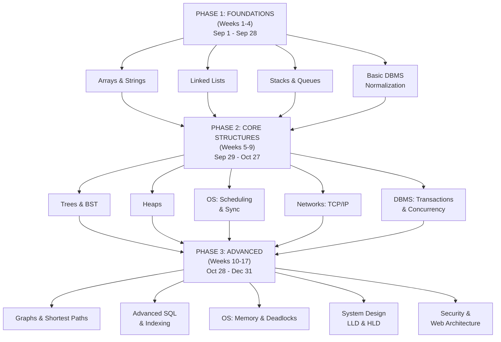

# Priority-Ordered Syllabus & Completion Roadmap

**Objective:** Clear sequencing of ALL topics with dependencies, prerequisites, and phased completion.  
**Timeline (Phase 1):** Aug 28 - Dec 31, 2026 (17 weeks) — 60% SEBI, 40% PBC parallel track  
**Total Study Load (Phase 1):** ~400 hours foundation (serving both SEBI + PBC)  
**Flexibility:** Phase 2 (Jan-Dec 2027) pivot depends on SEBI exam announcement status as of Jan 1, 2027

**NOTE:** This syllabus covers Phase 1 (foundation building). For Phase 2+ guidance, see 05-Pragmatic-Parallel-Track.md

## SEBI Phase 1 Additions (Run Every Week)

The technical sequence below is only one part of SEBI Phase 1. Add these short, recurring blocks from Week 1:

| Area | Weekly practice | Phase 1 target by Dec 31 |
| :--- | :--- | :--- |
| General Awareness and financial/regulatory awareness | 15–20 minutes, 4 days/week; dated current-affairs notes | 16 weeks reviewed monthly |
| English | 2 short sessions: comprehension, grammar, vocabulary, error spotting | 8 timed drills |
| Quantitative Aptitude | 2 short sessions: arithmetic, percentages, ratios, averages, DI, simplification | 8 timed drills |
| Reasoning | 2 short sessions: puzzles, syllogisms, inequalities, arrangements, coding | 8 timed drills |
| SEBI-style timed practice | One mixed sectional review every two weeks | 2 mixed reviews plus 2 full mocks |

Treat the final SEBI pattern and weightage as notification-dependent and verify them against the official notice when published.

### Phase 1 Chapter Sequence and Exam Style

1. **Weeks 1–4:** Quant basics, reasoning basics, English fundamentals, current-affairs log, DBMS foundations, arrays/strings, linked lists, stacks/queues.
2. **Weeks 5–9:** Arithmetic and DI, puzzle families, comprehension, financial awareness, trees/heaps, OS scheduling/synchronization, TCP/IP, transactions/concurrency.
3. **Weeks 10–14:** Mixed aptitude sets, regulatory/economic awareness, advanced SQL/indexing, graphs/shortest paths, OS memory/deadlocks, security/web, DP.
4. **Weeks 15–17:** Full Paper I and Paper II coverage, mixed technical MCQs, two full Phase I simulations, error-log revision, and speed training.

**Per-chapter standard:** learn for 30–45 minutes, recall without notes, solve 20–30 timed MCQs or 2–3 aptitude sets, classify errors, and revisit at 1/7/21 days. Use a roughly 40% learning, 40% timed practice, and 20% review split for SEBI-specific work.

---

## OVERVIEW: Topic Dependency Graph



---

## PHASE 1: FOUNDATIONAL STRUCTURES (Weeks 1–4)
**Goal:** Master prerequisites that ALL other topics depend on  
**Duration:** 4 weeks (Aug 28 - Sep 28)  
**Study Hours:** ~100 hours  
**Completion Target:** 100% (non-negotiable)

### SEBI Phase I Topics Covered in Phase 1

These chapters run alongside the technical topics below from Week 1:

| Paper | Chapters | Weekly style |
| :--- | :--- | :--- |
| **Paper I** | Quant: percentages, ratio, averages, profit/loss, interest, time/work, speed/distance, DI; Reasoning: inequalities, syllogisms, series, coding, arrangements, puzzles; English: comprehension, grammar, vocabulary; General Awareness: current affairs, financial markets, banking, SEBI, economy | 2 Quant sets, 2 Reasoning sets, 2 English drills, 4 current-affairs blocks |
| **Paper II IT** | Database/SQL, programming/DSA, algorithms, networks, operating systems, software engineering, web technologies, cybersecurity, analytics/cloud | 2 technical chapters/MCQ sessions and one spaced-revision block |

**Phase 1 exam output:** Complete starter coverage of both papers, maintain an error log, and take one mixed sectional review every two weeks.

### **Week 1 (Aug 28 - Sep 3): Arrays, Strings & Two-Pointer Technique**

**Why First?** Arrays are the foundation for ALL data structures. Two-pointer is the most common DSA pattern.

| Topic | Concepts | Problems | Hours | Deadline | Status |
| :--- | :--- | :--- | :--- | :--- | :--- |
| **Arrays Fundamentals** | Indexing, Iteration, Space/Time Complexity | 5 easy problems | 3 | Sep 1 | ▫️ |
| **Strings (Array of Chars)** | String manipulation, Substring problems | 5 easy problems | 3 | Sep 2 | ▫️ |
| **Two-Pointer Technique** | Container With Most Water, Merge Sorted Arrays | 5 medium problems | 4 | Sep 3 | ▫️ |
| **Sliding Window (Fixed)** | Max Consecutive Ones, Max Avg Subarray | 4 medium problems | 4 | Sep 3 | ▫️ |
| **Prefix Sums** | Range Sum Query, Cumulative Sum | 2 medium problems | 2 | Sep 3 | ▫️ |
| **Kadane's Algorithm** | Max Subarray Sum, Max Product Subarray | 2 medium problems | 2 | Sep 3 | ▫️ |
| **Concept Review & Error Log** | Write down all patterns, mistakes | — | 2 | Sep 3 | ▫️ |

**Week 1 Target:** 20 problems solved | ~20 hours  
**Materials:** LeetCode Arrays topic, Abdul Bari Array series  
**Success Metric:** Solve mediums in <20 mins

---

### **Week 2 (Sep 4 - Sep 10): Linked Lists**

**Why Second?** Linked lists are the next prerequisite for graphs and advanced structures.

| Topic | Concepts | Problems | Hours | Deadline | Status |
| :--- | :--- | :--- | :--- | :--- | :--- |
| **Linked List Basics** | Node structure, Traversal, Insertion, Deletion | 4 easy problems | 3 | Sep 5 | ▫️ |
| **Cycle Detection** | Floyd's Algorithm (Tortoise & Hare) | 2 medium problems | 3 | Sep 6 | ▫️ |
| **Reverse Linked List** | Single reversal, Reverse K-group | 3 medium problems | 4 | Sep 7 | ▫️ |
| **Merge Operations** | Merge sorted lists, Merge K lists (preview) | 2 medium problems | 3 | Sep 8 | ▫️ |
| **Other Patterns** | Remove duplicates, Reorder list | 3 medium problems | 3 | Sep 9 | ▫️ |
| **Concept Review** | Draw diagrams, trace manually | — | 2 | Sep 10 | ▫️ |

**Week 2 Target:** 14 problems solved | ~18 hours  
**Materials:** LeetCode Linked List, Abdul Bari series  
**Success Metric:** Trace Floyd's algorithm by hand

---

### **Week 3 (Sep 11 - Sep 17): Stacks, Queues & Monotonic Structures**

**Why Third?** Stacks/Queues are prerequisites for graphs (DFS/BFS) and many advanced problems.

| Topic | Concepts | Problems | Hours | Deadline | Status |
| :--- | :--- | :--- | :--- | :--- | :--- |
| **Stack Basics** | Push, Pop, LIFO, Implementation | 3 easy problems | 2 | Sep 12 | ▫️ |
| **Monotonic Stacks** | Next Greater Element, Largest Rectangle in Histogram | 4 medium problems | 5 | Sep 13 | ▫️ |
| **Expression Parsing** | Valid Parentheses, Infix to Postfix | 3 medium problems | 4 | Sep 14 | ▫️ |
| **Queue Basics** | Queue vs Deque, Circular Queue | 2 easy problems | 2 | Sep 15 | ▫️ |
| **BFS Prep** | Queue-based level-order traversal (preview) | 2 medium problems | 2 | Sep 16 | ▫️ |
| **Concept Review** | Stack/Queue implementations in code | — | 2 | Sep 17 | ▫️ |

**Week 3 Target:** 14 problems solved | ~17 hours  
**Materials:** LeetCode Stack & Queue  
**Success Metric:** Implement monotonic stack from scratch

---

### **Week 4 (Sep 18 - Sep 24): DBMS Fundamentals - Normalization & ER Models**

**Why Now?** DBMS theory must start early; it's conceptual and requires deep understanding.

| Topic | Concepts | Study Hours | Deadline | Status |
| :--- | :--- | :--- | :--- | :--- |
| **ER Diagrams** | Entity, Attribute, Relationship (1:1, 1:N, M:N) | 4 | Sep 19 | ▫️ |
| **Functional Dependencies** | Candidate Keys, Closure, Attribute Closure | 5 | Sep 20 | ▫️ |
| **Normalization: 1NF, 2NF, 3NF** | Decomposition, Loss-less joins | 6 | Sep 21 | ▫️ |
| **BCNF** | Higher normal form, Edge cases | 3 | Sep 22 | ▫️ |
| **Design Problems** | Normalize 3 real-world schemas | 4 | Sep 23 | ▫️ |
| **Error Log & Diagrams** | Document all rules and exceptions | 2 | Sep 24 | ▫️ |

**Week 4 Target:** Deep conceptual understanding | ~24 hours  
**Materials:** Korth *Database System Concepts* Ch. 6–7, GateOverflow ER/Normalization  
**Success Metric:** Normalize a schema to BCNF without errors

---

**END OF PHASE 1 (Sep 28):**
- ✅ DSA Fundamentals: Arrays, Strings, Linked Lists, Stacks, Queues (48 problems)
- ✅ DBMS Basics: ER models, Normalization theory
- ✅ SEBI Paper I starter routine: Quant, Reasoning, English, and current affairs
- ✅ PBC foundation started: one design artifact and one interview-readiness task

---

## PHASE 2: CORE DATA STRUCTURES & SYSTEMS THEORY (Weeks 5–9)
**Goal:** Build intermediate problem-solving skills and systems knowledge  
**Duration:** 5 weeks (Sep 29 - Oct 27)  
**Study Hours:** ~140 hours  
**Completion Target:** 95%+ (1 week buffer for weak areas)

### SEBI and PBC Topics Covered in Phase 2

- **SEBI Paper I:** Continue Quant, Reasoning, English, and current-affairs blocks every week.
- **SEBI Paper II:** Trees/heaps, OS scheduling and synchronization, TCP/IP, DBMS transactions, concurrency, and recovery.
- **PBC:** LLD rate limiter/LRU, SOLID and design patterns, HLD requirements, capacity estimates, APIs, and trade-offs.

### **Week 5 (Sep 29 - Oct 5): Trees, BST & Traversals**

**Prerequisite Met:** Arrays, recursion basics

| Topic | Concepts | Problems | Hours | Deadline | Status |
| :--- | :--- | :--- | :--- | :--- | :--- |
| **Tree Basics** | Tree structure, Terminology, Traversal setup | 3 easy | 2 | Sep 30 | ▫️ |
| **Inorder, Preorder, Postorder** | DFS traversals, Recursive & Iterative | 5 medium | 5 | Oct 1 | ▫️ |
| **Level-Order / BFS** | Breadth-First Traversal, Queue-based | 3 medium | 3 | Oct 2 | ▫️ |
| **BST Operations** | Search, Insert, Delete, Validate BST | 4 medium | 5 | Oct 3 | ▫️ |
| **LCA & Path Problems** | Lowest Common Ancestor, Path Sum, Max Path Sum | 4 medium | 5 | Oct 4 | ▫️ |
| **Tree Construction** | Build tree from traversals, Serialize/Deserialize | 3 medium | 4 | Oct 5 | ▫️ |

**Week 5 Target:** 22 problems solved | ~24 hours  
**Materials:** LeetCode Trees, Abdul Bari Tree series  
**Success Metric:** Code BST delete operation from scratch

---

### **Week 6 (Oct 6 - Oct 12): Heaps & Priority Queues**

**Prerequisite Met:** Arrays, Trees

| Topic | Concepts | Problems | Hours | Deadline | Status |
| :--- | :--- | :--- | :--- | :--- | :--- |
| **Heap Data Structure** | Min-Heap, Max-Heap, Heap property, Insertion/Deletion | 2 easy | 3 | Oct 7 | ▫️ |
| **Heapify Operations** | Build Heap, Percolate Up/Down | 2 medium | 3 | Oct 8 | ▫️ |
| **Top-K Elements** | Kth Largest, Kth Smallest, Median of Stream | 4 medium | 5 | Oct 9 | ▫️ |
| **Heap Sort** | Sorting using heap | 1 medium | 2 | Oct 10 | ▫️ |
| **Advanced Heap** | Merge K Sorted Lists, Sliding Window Maximum | 2 medium | 3 | Oct 11 | ▫️ |
| **Implementation Practice** | Code heap from scratch | — | 3 | Oct 12 | ▫️ |

**Week 6 Target:** 10 problems + 1 full heap implementation | ~19 hours  
**Materials:** LeetCode Heap, CLRS Ch. 6  
**Success Metric:** Implement min-heap with decrease-key operation

---

### **Week 7 (Oct 13 - Oct 19): OS - Process Management & CPU Scheduling**

**Prerequisite Met:** Basic computer concepts

| Topic | Concepts | PYQ Problems | Hours | Deadline | Status |
| :--- | :--- | :--- | :--- | :--- | :--- |
| **Process vs Thread** | Process model, Context switching, PCB | 3 GATE PYQs | 4 | Oct 14 | ▫️ |
| **CPU Scheduling Algorithms** | FCFS, SJF, RR, Priority, Preemptive vs Non-preemptive | 8 GATE PYQs | 6 | Oct 15 | ▫️ |
| **Scheduling Metrics** | Turnaround time, Waiting time, Response time | 4 GATE PYQs | 3 | Oct 16 | ▫️ |
| **Priority Scheduling** | Dynamic priorities, Starvation, Aging | 3 GATE PYQs | 2 | Oct 17 | ▫️ |
| **Synchronization Basics** | Race conditions, Critical section problem (setup) | — | 3 | Oct 18 | ▫️ |
| **Error Log & Diagrams** | Gantt charts, state transition diagrams | — | 2 | Oct 19 | ▫️ |

**Week 7 Target:** 18 GATE OS PYQs solved | ~20 hours  
**Materials:** Galvin *Operating System Concepts* Ch. 5–6, GateOverflow OS PYQs  
**Success Metric:** 90%+ accuracy on scheduling PYQs

---

### **Week 8 (Oct 20 - Oct 26): Networks - TCP/IP Fundamentals**

**Prerequisite Met:** Basic networking concepts

| Topic | Concepts | PYQ Problems | Hours | Deadline | Status |
| :--- | :--- | :--- | :--- | :--- | :--- |
| **OSI vs TCP/IP Model** | Layer architectures, Protocol mapping | 2 PYQs | 3 | Oct 21 | ▫️ |
| **TCP/UDP & Transport Layer** | 3-Way Handshake, Connection termination, UDP | 6 PYQs | 5 | Oct 22 | ▫️ |
| **TCP Flow Control** | Sliding Window, Window size negotiation | 3 PYQs | 4 | Oct 23 | ▫️ |
| **Congestion Control** | Slow Start, Congestion Avoidance, Fast Retransmit | 4 PYQs | 4 | Oct 24 | ▫️ |
| **IP Layer Basics** | IPv4 addressing, ARP, ICMP | 3 PYQs | 3 | Oct 25 | ▫️ |
| **Concept Review** | Draw protocol flows, state machines | — | 2 | Oct 26 | ▫️ |

**Week 8 Target:** 18 Network PYQs solved | ~21 hours  
**Materials:** Kurose & Ross Ch. 3–4, GateOverflow Network PYQs  
**Success Metric:** Draw TCP 3-way handshake + explain each step

---

### **Week 9 (Oct 27 - Nov 2): DBMS - Transactions, ACID & Concurrency Control**

**Prerequisite Met:** DBMS normalization basics

| Topic | Concepts | Study Hours | Deadline | Status |
| :--- | :--- | :--- | :--- | :--- | :--- |
| **ACID Properties** | Atomicity, Consistency, Isolation, Durability | 4 | Oct 28 | ▫️ |
| **Transaction Logs & WAL** | Write-Ahead Logging, Recovery mechanism | 4 | Oct 29 | ▫️ |
| **Concurrency Problems** | Dirty Read, Non-Repeatable Read, Phantom Read | 3 | Oct 30 | ▫️ |
| **Locking & 2PL** | Lock types, Two-Phase Locking, Strict 2PL | 5 | Oct 31 | ▫️ |
| **Deadlock Detection** | Wait-for graphs, Cycle detection, Resolution | 4 | Nov 1 | ▫️ |
| **Isolation Levels** | Read Uncommitted, Read Committed, Repeatable Read, Serializable | 4 | Nov 2 | ▫️ |

**Week 9 Target:** Deep conceptual mastery + 15 PYQs | ~24 hours  
**Materials:** Korth Ch. 15–16, GateOverflow DBMS PYQs  
**Success Metric:** Trace schedule execution step-by-step

---

**END OF PHASE 2 (Nov 2):**
- ✅ DSA: Trees (22), Heaps (10) = 32 problems
- ✅ OS: Process/Scheduling (18 PYQs)
- ✅ Networks: TCP/IP (18 PYQs)
- ✅ DBMS: Transactions & Concurrency (15 PYQs)
- **Total so far:** 80+ DSA problems, 51 PYQ problems

---

## PHASE 3: ADVANCED STRUCTURES, SYSTEM DESIGN & SPECIALIZATION (Weeks 10–17)
**Goal:** Master advanced algorithms, system design, and achieve interview readiness  
**Duration:** 8 weeks (Nov 3 - Dec 31)  
**Study Hours:** ~210 hours  
**Completion Target:** 100%

### SEBI and PBC Topics Covered in Phase 3

- **SEBI Paper I:** Mixed timed Paper I sets, English comprehension, financial/regulatory current affairs, and speed/error-log revision.
- **SEBI Paper II:** Graphs, shortest paths, advanced SQL/indexing, OS memory/deadlocks, DP, software engineering, web, and cybersecurity.
- **PBC:** HLD systems, LLD implementations, behavioral stories, resume evidence, mock interviews, and compensation preparation.

### **Week 10 (Nov 3 - Nov 9): Graphs - BFS, DFS & Basic Traversals**

**Prerequisite Met:** Trees, Queues, Stacks

| Topic | Concepts | Problems | Hours | Deadline | Status |
| :--- | :--- | :--- | :--- | :--- | :--- |
| **Graph Representation** | Adjacency List, Adjacency Matrix, Complexity | 2 easy | 2 | Nov 4 | ▫️ |
| **BFS (Breadth-First Search)** | Queue-based, Connected Components, Level-order | 4 medium | 5 | Nov 5 | ▫️ |
| **DFS (Depth-First Search)** | Stack/Recursive, Topological Sort (preview) | 4 medium | 5 | Nov 6 | ▫️ |
| **Cycle Detection** | Directed & Undirected graphs | 2 medium | 3 | Nov 7 | ▫️ |
| **Connected Components** | Number of islands, Province connections | 3 medium | 4 | Nov 8 | ▫️ |
| **Implementation Review** | Code BFS + DFS iterative & recursive | — | 2 | Nov 9 | ▫️ |

**Week 10 Target:** 15 problems solved | ~21 hours  
**Materials:** LeetCode Graphs, CLRS Ch. 22  
**Success Metric:** Solve graph problems without looking at hints

---

### **Week 11 (Nov 10 - Nov 16): Graphs - Shortest Paths (Dijkstra, Bellman-Ford, Floyd-Warshall)**

**Prerequisite Met:** BFS, Priority Queues

| Topic | Concepts | Problems | Hours | Deadline | Status |
| :--- | :--- | :--- | :--- | :--- | :--- |
| **Dijkstra's Algorithm** | Greedy approach, Relaxation, Priority Queue | 4 medium | 6 | Nov 11 | ▫️ |
| **Bellman-Ford Algorithm** | Dynamic programming, Negative weights, Relaxation | 2 medium | 4 | Nov 12 | ▫️ |
| **Floyd-Warshall Algorithm** | All-pairs shortest path, DP approach | 2 medium | 4 | Nov 13 | ▫️ |
| **Minimum Spanning Tree (MST)** | Kruskal's, Prim's algorithms | 3 medium | 5 | Nov 14 | ▫️ |
| **Advanced Graphs** | Topological Sort, DAG problems | 3 medium | 4 | Nov 15 | ▫️ |
| **Manual Tracing** | Trace Dijkstra, MST by hand | — | 2 | Nov 16 | ▫️ |

**Week 11 Target:** 14 problems solved | ~25 hours  
**Materials:** LeetCode Graphs, CLRS Ch. 23–24  
**Success Metric:** Prove Dijkstra correctness, trace MST algorithm

---

### **Week 12 (Nov 17 - Nov 23): Advanced SQL & Database Indexing**

**Prerequisite Met:** DBMS Normalization, Transactions

| Topic | Concepts | Problems | Hours | Deadline | Status |
| :--- | :--- | :--- | :--- | :--- | :--- |
| **Complex Joins** | Inner, Left, Right, Full Outer, Self-join | 5 hard SQL | 6 | Nov 18 | ▫️ |
| **Subqueries & CTEs** | Correlated subqueries, WITH clauses | 5 hard SQL | 6 | Nov 19 | ▫️ |
| **Window Functions** | ROW_NUMBER, RANK, DENSE_RANK, LEAD, LAG | 8 hard SQL | 8 | Nov 20 | ▫️ |
| **Indexing Mechanics** | B-Trees, B+ Trees, Hash Indexes, Clustered vs Non-clustered | Theory | 5 | Nov 21 | ▫️ |
| **Query Optimization** | Execution plans, Index selection, Query rewriting | 5 problems | 5 | Nov 22 | ▫️ |
| **Practice & Review** | Mixed SQL problems | — | 3 | Nov 23 | ▫️ |

**Week 12 Target:** 23 Hard SQL problems solved | ~33 hours  
**Materials:** LeetCode Database SQL, Korth Ch. 12–14  
**Success Metric:** Optimize query using proper indexes

---

### **Week 13 (Nov 24 - Nov 30): OS - Memory Management & Deadlocks**

**Prerequisite Met:** OS Process management, Synchronization basics

| Topic | Concepts | PYQ Problems | Hours | Deadline | Status |
| :--- | :--- | :--- | :--- | :--- | :--- |
| **Paging & Virtual Memory** | Page table, Page faults, TLB, Page replacement (LRU, FIFO) | 10 PYQs | 8 | Nov 25 | ▫️ |
| **Segmentation** | Segment table, Fragmentation | 3 PYQs | 3 | Nov 26 | ▫️ |
| **Deadlock Conditions** | Mutual Exclusion, Hold & Wait, No Preemption, Circular Wait | 4 PYQs | 3 | Nov 27 | ▫️ |
| **Deadlock Prevention** | Break one of the 4 conditions | 3 PYQs | 2 | Nov 28 | ▫️ |
| **Banker's Algorithm** | Safe sequence, Resource allocation | 4 PYQs | 4 | Nov 29 | ▫️ |
| **Manual Solving** | Trace page replacement, solve banker's by hand | — | 3 | Nov 30 | ▫️ |

**Week 13 Target:** 24 OS PYQs solved | ~23 hours  
**Materials:** Galvin Ch. 8–10, GateOverflow OS PYQs  
**Success Metric:** Solve banker's algorithm step-by-step

---

### **Week 14 (Dec 1 - Dec 7): Dynamic Programming - 1D & 2D**

**Prerequisite Met:** Recursion, Arrays, Trees

| Topic | Concepts | Problems | Hours | Deadline | Status |
| :--- | :--- | :--- | :--- | :--- | :--- |
| **1D DP Problems** | Climbing Stairs, House Robber, Coin Change | 6 medium | 8 | Dec 2 | ▫️ |
| **2D DP Problems** | 0/1 Knapsack, Unbounded Knapsack, Coin Change 2 | 5 medium | 7 | Dec 3 | ▫️ |
| **String DP** | LCS, LIS, Edit Distance, Regex Matching | 6 medium | 8 | Dec 4 | ▫️ |
| **Matrix DP** | Max Path Sum, Unique Paths, Burst Balloons | 4 medium | 6 | Dec 5 | ▫️ |
| **Tree DP** | Tree DP problems (e.g., House Robber III) | 2 medium | 3 | Dec 6 | ▫️ |
| **DP Patterns Review** | Memoization vs Tabulation, State identification | — | 2 | Dec 7 | ▫️ |

**Week 14 Target:** 23 DP problems solved | ~34 hours  
**Materials:** LeetCode DP, CLRS Ch. 14–15  
**Success Metric:** Identify DP state in unseen problem <10 mins

---

### **Week 15 (Dec 8 - Dec 14): System Design - Low-Level Design (LLD) & Design Patterns**

**Prerequisite Met:** OOP concepts, basic architecture thinking

| Topic | Concepts | Implementation | Hours | Deadline | Status |
| :--- | :--- | :--- | :--- | :--- | :--- |
| **SOLID Principles** | SRP, OCP, LSP, ISP, DIP with code examples | Review 10 code examples | 6 | Dec 9 | ▫️ |
| **Design Patterns: Creational** | Factory, Singleton, Builder, Prototype | Code 4 patterns | 6 | Dec 10 | ▫️ |
| **Design Patterns: Structural** | Adapter, Decorator, Proxy, Facade | Code 4 patterns | 6 | Dec 11 | ▫️ |
| **Design Patterns: Behavioral** | Strategy, Observer, Command, Chain of Responsibility | Code 4 patterns | 6 | Dec 12 | ▫️ |
| **LLD Problem 1: Rate Limiter** | Token Bucket, Sliding Window algorithms | Full implementation | 5 | Dec 13 | ▫️ |
| **LLD Problem 2: LRU Cache** | Linked HashMap, Cache eviction policy | Full implementation | 5 | Dec 14 | ▫️ |

**Week 15 Target:** 12 design patterns + 2 LLD implementations | ~34 hours  
**Materials:** Refactoring.Guru, Head First Design Patterns  
**Success Metric:** Write compile-ready LLD code with SOLID patterns

---

### **Week 16 (Dec 15 - Dec 21): System Design - High-Level Design (HLD)**

**Prerequisite Met:** Networking, Databases, Scalability concepts

| Topic | System Design | Components | Hours | Deadline | Status |
| :--- | :--- | :--- | :--- | :--- | :--- |
| **HLD 1: URL Shortener (TinyURL)** | API Design, Encoding, DB Schema, Scaling | 2 hrs | 3 | Dec 16 | ▫️ |
| **HLD 2: Distributed Logger** | Log ingestion, Storage, Querying, Retention | 2 hrs | 3 | Dec 17 | ▫️ |
| **HLD 3: Real-Time Chat System** | WebSockets, Message delivery, Persistence | 2.5 hrs | 3 | Dec 18 | ▫️ |
| **HLD 4: File Storage System** | Blob storage, Replication, Consistency | 2.5 hrs | 3 | Dec 19 | ▫️ |
| **HLD 5: Rate Limiter (Distributed)** | Token Bucket (distributed), Consistency | 2 hrs | 3 | Dec 20 | ▫️ |
| **Capacity Planning & Trade-offs** | Metrics estimation, CAP theorem analysis | — | 4 | Dec 21 | ▫️ |

**Week 16 Target:** 5 Complete HLD system designs | ~19 hours  
**Materials:** Alex Xu *System Design Interview* Vol. 1–2, ByteByteGo YouTube  
**Success Metric:** Draw block diagrams with justified trade-offs

---

### **Week 17 (Dec 22 - Dec 31): Final Review, Mock Tests & Weak Area Consolidation**

**Prerequisite Met:** Everything from Weeks 1–16

| Activity | Target | Hours | Deadline | Status |
| :--- | :--- | :--- | :--- | :--- |
| **Full-Length Mock Test 1** | SEBI IT Mocks (Testbook/Oliveboard) | 3 | Dec 23 | ▫️ |
| **Weak Area Review: DSA** | Redo top 10 mistakes | 4 | Dec 25 | ▫️ |
| **Weak Area Review: DBMS** | Redo concurrency control problems | 3 | Dec 26 | ▫️ |
| **Weak Area Review: OS** | Memory management + deadlocks recap | 3 | Dec 27 | ▫️ |
| **Full-Length Mock Test 2** | SEBI IT Mocks (different version) | 3 | Dec 28 | ▫️ |
| **Security & Web Arch** | OWASP, OAuth, API design principles | 4 | Dec 29 | ▫️ |
| **Final Error Log Review** | Consolidate all learnings | 2 | Dec 30 | ▫️ |
| **Celebratory Review** | Recap journey, identify next steps for 2027 | 1 | Dec 31 | ▫️ |

**Week 17 Target:** 2 Full-length mock tests + comprehensive review | ~23 hours  
**Materials:** All materials + Testbook/Oliveboard SEBI IT mocks  
**Success Metric:** >75% aggregate mock test score

---

**END OF PHASE 3 (Dec 31):**
- ✅ DSA: 150 Mediums + 20 Hards completed
- ✅ DBMS: 60+ PYQs + 23 SQL problems
- ✅ OS: 42+ PYQs + Memory/Deadlock deep dives
- ✅ Networks: 18+ PYQs + full understanding
- ✅ System Design: 12 design patterns + 2 LLD problems + 5 HLD designs
- ✅ Mock Tests: 2 full-length tests, 75%+ score

---

## CUMULATIVE COMPLETION CHECKLIST

### **DSA & Coding (150 total)**
- [x] Arrays & Strings: 20 ✓ (Week 1)
- [x] Linked Lists: 14 ✓ (Week 2)
- [x] Stacks & Queues: 14 ✓ (Week 3)
- [x] Trees & BST: 22 ✓ (Week 5)
- [x] Heaps: 10 ✓ (Week 6)
- [x] Graphs (BFS/DFS): 15 ✓ (Week 10)
- [x] Shortest Paths & MST: 14 ✓ (Week 11)
- [x] Binary Search: 10 (integrated into weeks)
- [x] Recursion & Backtracking: 12 (integrated into weeks)
- [x] Dynamic Programming: 23 ✓ (Week 14)
- [x] Final Review/Mixed: 6 (Week 17)
- **TOTAL DSA: 170 problems**

### **DBMS & SQL (90+ total)**
- [x] Normalization & ER Models: Conceptual ✓ (Week 4)
- [x] Transactions & ACID: 15 PYQs ✓ (Week 9)
- [x] Concurrency Control: 15 PYQs ✓ (Week 9)
- [x] Advanced SQL: 23 Hard problems ✓ (Week 12)
- [x] Indexing & Optimization: 5 problems ✓ (Week 12)
- **TOTAL DBMS: 58 problems + deep theory**

### **OS & Networks (60+ total)**
- [x] Process & Scheduling: 18 PYQs ✓ (Week 7)
- [x] Networking: 18 PYQs ✓ (Week 8)
- [x] Memory Management: 10 PYQs ✓ (Week 13)
- [x] Deadlocks: 4 PYQs ✓ (Week 13)
- [x] Other OS topics: 14 PYQs (integrated)
- **TOTAL OS/NETWORKS: 64 PYQs**

### **System Design (19 total)**
- [x] Design Patterns: 12 ✓ (Week 15)
- [x] LLD Problems: 2 ✓ (Week 15)
- [x] HLD Systems: 5 ✓ (Week 16)
- **TOTAL SYSTEM DESIGN: 19 implementations**

### **Mock Tests & Final Review**
- [x] Full-Length SEBI IT Mock Tests: 2 ✓ (Week 17)
- [x] Weak area consolidation: Done ✓ (Week 17)

---

## TIMELINE OVERVIEW AT-A-GLANCE

```
WEEK  DATES       PHASE    P0 TOPIC              P1 TOPIC              STATUS
───────────────────────────────────────────────────────────────────────────
1     Aug 28-Sep3 Phase 1  Arrays & Strings      —                     ▫️
2     Sep 4-10    Phase 1  Linked Lists          —                     ▫️
3     Sep 11-17   Phase 1  Stacks & Queues       —                     ▫️
4     Sep 18-24   Phase 1  DBMS Normalization    —                     ▫️
5     Oct 1-5     Phase 2  Trees & BST           —                     ▫️
6     Oct 6-12    Phase 2  Heaps                 —                     ▫️
7     Oct 13-19   Phase 2  OS: Scheduling        —                     ▫️
8     Oct 20-26   Phase 2  Networks: TCP/IP      —                     ▫️
9     Oct 27-Nov2 Phase 2  DBMS: Transactions    —                     ▫️
10    Nov 3-9     Phase 3  Graphs: BFS/DFS       —                     ▫️
11    Nov 10-16   Phase 3  Shortest Paths & MST  —                     ▫️
12    Nov 17-23   Phase 3  Advanced SQL          —                     ▫️
13    Nov 24-30   Phase 3  OS: Memory/Deadlock   —                     ▫️
14    Dec 1-7     Phase 3  Dynamic Programming   Design Patterns       ▫️
15    Dec 8-14    Phase 3  Final DSA Review      LLD (Rate Limiter)    ▫️
16    Dec 15-21   Phase 3  Final Review          HLD Systems           ▫️
17    Dec 22-31   Phase 3  Mock Tests            Final Consolidation   ▫️
```

---

## KEY SUCCESS FACTORS

### **Critical Path (Non-Negotiable):**
1. **Week 1–4:** Complete ALL Phase 1 topics (Arrays, Strings, LinkedLists, Stacks, Queues, DBMS basics)
2. **Week 5–9:** Complete ALL Phase 2 (Trees, Heaps, OS, Networks, DBMS advanced)
3. **Week 10–14:** Complete DSA foundations (Graphs, Shortest Paths, DP)
4. **Week 15–16:** System Design (LLD + HLD) — differentiator for SDE interviews
5. **Week 17:** Mock tests and weak area consolidation

### **Burnout Prevention Rules:**
- If any week falls behind: **Skip P1 (System Design)** that week, keep P0 (DSA/DBMS/OS) on track
- If >2 weeks behind: Switch to "Recovery Mode" (error logs, concept sketching only) for 1 week
- **Non-negotiable:** 7–8 hrs sleep, exercise 5x/week, 3 meals daily

### **Progress Tracking (Update Weekly):**
- Mark completion status for each week
- Log mistakes in error log (within 1 hour of solving)
- Adjust next week's plan if falling behind
- Target: 24 hours active study per week (max)

---

**Last Updated:** 2026-08-28  
**Next Review:** Every Sunday evening  
**Reference:** Back up to [01-Master-Study-Plan.md](01-Master-Study-Plan.md) for detailed resources & burnout protocols
